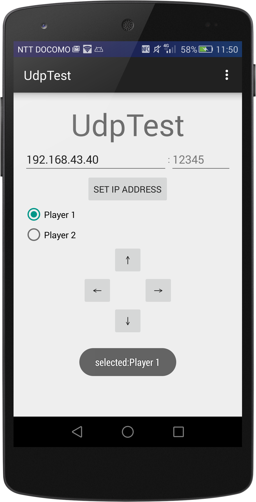

# Android_UDP

##What's this
Android上で動作するUDP通信アプリ。

テトリスゲームが実装されてます。
ただし、このアプリはコントローラ機能のみを提供。

##Goal
__Processingで動作しているプログラムと通信する__こと。
[satsukies/Processing_UDP]("https://github.com/satsukies/Processing_UDP")
でゲーム本体を配布してます。